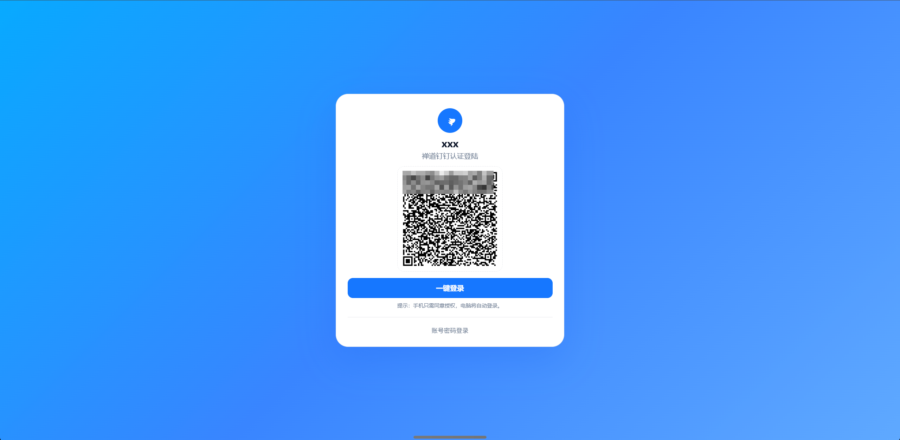

# Zentao_DingTalk_SSO 登录集成
```
前置说明：
禅道版本：21.7
安装方式：Docker compose 安装
开发类型：Python Flask + PHP ZIN “页脚注入”法
```
## 项目简介
本项目实现了钉钉扫码 / 一键登录与禅道系统的单点登录（SSO）集成。支持：
- **PC 端一键登录**
- **移动端扫码登录**
- **新用户自动注册并分配默认角色 / 部门**
- **老用户直接免密登录**



## 架构概览

```
核心流程
1. 用户访问 zentao.xxxx.cn
2. 外层 Nginx(80)将请求转发到内层 Nginx (5000)
3. 内层 Nginx 根据路径分发：
    ○ / → 禅道
    ○ /dingtalk/* → Flask SSO 网关
4. 登录页 UI 注入，显示钉钉一键登录和二维码
5. 用户选择：
    ○ PC 一键登录 → 跳转钉钉 OAuth2 授权 → （确认用户是否存在）同意授权进入禅道
    ○ 扫码登录 → PC 轮询二维码状态，手机授权后通知 PC → （确认用户是否存在）同意授权进入禅道
6. SSO 网关：
    ○ 调用钉钉 API 获取用户信息权限
    ○ 查询禅道用户表：
        ■ 如果存在 → 调用禅道 API 直接登录（apilogin）
        ■ 如果不存在 → 自动创建用户并赋予默认权限，再登录
7. 登录成功后直接进入首页，保持浏览器已登录状态（Cookie relay）
```

## 功能特性
- 支持钉钉 OAuth2 授权码模式
- 新用户首次登录时自动创建禅道账号
- 支持 MySQL 直写和 ZenTao 官方 API 两种方式创建用户
- 支持 PC 一键登录和二维码扫码
- 登录成功后自动跳转至禅道首页（PC），或关闭页面（手机端）
- 全量日志记录，方便排错

## 技术栈
- **后端**：Python 3.9 + Flask + Gunicorn
- **数据库**：MySQL（用于直连创建用户）
- **前端嵌入**：禅道登录页 HTML / JS 注入
- **外部接口**：
  - DingTalk v1.0 API
  - 禅道 OpenAPI（可选）

## 主要目录结构
```
.
├── app.py                  # Flask 主入口
├── config.py               # 配置文件 (钉钉、禅道、MySQL 参数)
├── gunicorn.conf.py        # 配置文件 (gunucorn)
├── services/
│   ├── zentao_api.py       # 禅道 API/MySQL 用户管理适配
│   ├── dingtalk_api.py     # 钉钉 API 调用封装
│   ├── bind_store.py       # 账号绑定存储封装
│   ├── org_sync.py         # 组织架构同步，用户字段构建
├── templates/
│   ├── error.html          # 错误页面
│   └── success.html        # 成功页面
├── static/                 # 静态资源
└── systemd/                # 懒得写
    └── dingtalk-login.service # systemd 启动配置
```

## 部署步骤

### 1. 克隆项目
```bash
git clone https://github.com/yourname/dingtalk-zentao-sso.git
cd dingtalk-zentao-sso
```

### 2. 安装依赖
```bash
python3 -m venv .venv
source .venv/bin/activate
pip install -r requirements.txt
```

### 3. 配置 `config.py`
```python
# 钉钉配置
DINGTALK_APP_KEY = "app_key"
DINGTALK_APP_SECRET = "app_secret"
DINGTALK_REDIRECT_URI = "http://sso_domain/dingtalk/callback"

# 禅道配置
ZENTAO_BASE = "http://zentao_domain"
ZENTAO_CREATE_MODE = "mysql"  # 或 "api"

# MySQL 直连配置
MYSQL_HOST = "127.0.0.1"
MYSQL_PORT = 3306
MYSQL_DB = "zentao"
MYSQL_USER = "root"
MYSQL_PASS = "password"
MYSQL_TABLE_PREFIX = "zt_"

# 默认新用户
DEFAULT_ROLE = "pm"
DEFAULT_DEPT_ID = 0
```

### 4. 前端注入
```bash
php -r '
$f="/apps/zentao/module/user/ui/login.html.php";
$c=file_get_contents($f);
if(strpos($c,"dt_login_inject.php")===false){
  if(preg_match("/\\bnamespace\\s+zin\\s*;/",$c,$m,PREG_OFFSET_CAPTURE)){
    $p=$m[0][1]+strlen($m[0][0]);
    $ins="\n/* __DT_INJECT__ */ include __DIR__ . \"/../ext/ui/dt_login_inject.php\";";
    $c=substr($c,0,$p).$ins.substr($c,$p);
    file_put_contents($f,$c);
    echo \"[OK] injected after namespace\\n\";
  } else {
    file_put_contents($f,\"<?php /* __DT_INJECT__ */ include __DIR__ . \\\"/../ext/ui/dt_login_inject.php\\\"; ?>\\n\".$c);
    echo \"[OK] prepended include\\n\";
  }
} else {
  echo \"[SKIP] already injected\\n\";
}
'
```
修改禅道登录页 HTML（`/apps/zentao/module/user/ext/ui/dt_login_inject.php`），在合适位置添加：
```php
<?php
/* 钉钉登录注入页（上下结构 + 渐变背景 + 票据轮询，所有接口走绝对地址到 Flask） */
$uri     = $_SERVER['REQUEST_URI'] ?? '';
$logged  = !empty($this->app->user->account ?? '');
$isLogin = (stripos($uri,'m=user')!==false && stripos($uri,'f=login')!==false) || stripos($uri,'user-login')!==false;
if($logged || !$isLogin) return;

/* ——  Flask 对外地址（HTTP） —— */
$httpHost = 'http://zentao.xxxx.cn';

/* 计算 return（优先 ?return，其次 Referer） */
$return = isset($_GET['return']) ? $_GET['return'] : ($_SERVER['HTTP_REFERER'] ?? '/');

/* 二维码基础地址（绝对地址，后续由前端补 ticket&t= 防缓存） */
$qrAPI  = '/dingtalk/qrcode';
$qrBase = $httpHost . $qrAPI . (strpos($qrAPI,'?')===false?'?':'&') . 'return=' . urlencode($return);
?><!DOCTYPE html>
<html lang="zh-CN"><head>
<meta charset="utf-8"/><meta name="viewport" content="width=device-width, initial-scale=1"/>
<title>禅道登陆页</title>
<style>
:root{--brand:#1677FF;--card:#fff;--border:#e5e7eb;--text:#0f172a;--muted:#64748b}
*{box-sizing:border-box} html,body{height:100%}
body{margin:0;font-family:system-ui,-apple-system,Segoe UI,Roboto,Arial,"PingFang SC","Microsoft YaHei",sans-serif;color:var(--text)}
.bg{position:fixed;inset:0;background:linear-gradient(135deg,#0ea5ff,#3b82f6 50%,#60a5fa);filter:saturate(1.05) brightness(1.02)}
.wrap{position:relative;z-index:1;min-height:100%;display:grid;place-items:center;padding:24px}
.card{width:min(92vw,520px);background:var(--card);border:1px solid var(--border);border-radius:28px;box-shadow:0 30px 80px rgba(28,100,242,.25);padding:26px}
.logo{width:56px;height:56px;border-radius:50%;display:grid;place-items:center;margin:6px auto 10px;background:var(--brand);color:#fff}
.logo svg{width:28px;height:28px}
h1{margin:6px 0 4px;text-align:center;font-size:22px}
.sub{color:var(--muted);text-align:center;margin-bottom:14px}
.qr{width:240px;height:240px;border:1px dashed var(--border);border-radius:16px;margin:0 auto 14px;display:grid;place-items:center;background:#fff;overflow:hidden}
.qr img{width:100%;height:100%;object-fit:contain;image-rendering:crisp-edges}
.btnP{display:block;width:100%;text-align:center;margin:0 auto 10px;padding:12px 14px;border-radius:12px;background:var(--brand);color:#fff;text-decoration:none;font-weight:700;border:1px solid var(--brand)}
.btnRow{display:flex;gap:10px;justify-content:center;margin-bottom:6px}
.btn{display:inline-flex;align-items:center;justify-content:center;padding:9px 12px;border-radius:10px;background:#fff;border:1px solid var(--border);text-decoration:none;color:var(--text);font-weight:600}
.hint{color:var(--muted);font-size:12px;text-align:center;margin-top:2px}
.hr{height:1px;background:var(--border);margin:18px 0}
.toggle{text-align:center}
.toggle button{background:none;border:none;color:var(--muted);cursor:pointer;font-size:14px}
.pwd{display:none;margin-top:10px}
.input{width:100%;padding:12px 14px;border:1px solid var(--border);border-radius:12px;font-size:14px}
.input:focus{border-color:var(--brand);box-shadow:0 0 0 3px rgba(22,119,255,.15);outline:0}
@media (max-width:420px){ .qr{width:200px;height:200px} }
</style>
</head>
<body>
<div class="bg"></div>
<div class="wrap"><div class="card">
  <div class="logo" aria-hidden="true">
    <svg viewBox="0 0 24 24" fill="currentColor"><path d="M19.7 8.3c-3.1.5-6.2.2-9.2-1-.3-.1-.6.2-.5.5.5 1.3 1.7 3.1 3.6 4.1-1.6.1-3-.3-4.1-.8-.3-.1-.6.2-.5.5.6 1.5 1.9 2.9 3.8 3.6-1.4.1-2.7-.2-3.8-.6-.3-.1-.6.2-.5.5.8 2.1 2.7 3.9 5.5 4.3l-.8 2.6c-.1.4.4.7.6.4l3-3.1c.1-.1.2-.3.1-.4l-.6-1.9c2.3-.6 3.9-2.1 4.8-3.7 1.5-2.6 1-5.1-1.4-4.8z"/></svg>
  </div>
  <h1>xxx</h1>
  <div class="sub">禅道钉钉认证登陆</div>

  <div class="qr"></div>

  <a class="btnP" href="javascript:void(0)" id="dtJump">一键登录</a>
  <div class="hint">提示：手机只需同意授权，电脑将自动登录。</div>

  <div class="hr"></div>
  <div class="toggle"><button id="pwdToggle" type="button" aria-expanded="false">账号密码登录</button></div>
  <div id="pwdPanel" class="pwd" aria-hidden="true">
    <form method="post" action="/index.php?m=user&f=login">
      <input class="input" type="text" name="account" autocomplete="username" placeholder="账号 / 邮箱 / 手机" style="margin-bottom:10px"/>
      <input class="input" type="password" name="password" autocomplete="current-password" placeholder="密码" style="margin-bottom:10px"/>
      <input type="hidden" name="referer" value="<?php echo htmlspecialchars($return,ENT_QUOTES); ?>"/>
      <button class="btnP" type="submit">登录</button>
      <div class="hint">如无本地账号，请使用钉钉登录。</div>
    </form>
  </div>
</div></div>

<script>
(function(){
  var returnUrl = location.href;
  var img   = document.getElementById('dtQR');
  var btnGo = document.getElementById('dtJump');
  var btnRF = document.getElementById('dtRefresh');

  var HOST = <?php echo json_encode($httpHost, JSON_UNESCAPED_SLASHES); ?>;
  var QRBASE = <?php echo json_encode($qrBase,   JSON_UNESCAPED_SLASHES); ?>;

  // 1) 申请票据
  fetch(HOST + '/dingtalk/newticket?return=' + encodeURIComponent(returnUrl), {credentials:'include'})
    .then(function(r){return r.json();})
    .then(function(j){
      if(!j || !j.ticket){ console.warn('newticket 失败'); return; }
      var ticket = j.ticket;

      // 2) 设置二维码（ticket + 防缓存）
      function setQR(){ if(img) img.src = QRBASE + '&ticket=' + encodeURIComponent(ticket) + '&t=' + Date.now(); }
      setQR();
      setInterval(setQR, 60000);
      if(btnRF) btnRF.onclick = setQR;

      // 3) 一键登录（同票据）
      if(btnGo){
        btnGo.href = HOST + '/dingtalk/login?ticket=' + encodeURIComponent(ticket) + '&return=' + encodeURIComponent(returnUrl);
      }

      // 4) 轮询状态，OK 后在 PC 浏览器里完成登录
      var timer = setInterval(function(){
        fetch(HOST + '/dingtalk/status?ticket=' + encodeURIComponent(ticket), {credentials:'include'})
          .then(function(r){return r.json();})
          .then(function(s){
            if(s && s.ok){
              clearInterval(timer);
              var go = s.redirect || <?php echo json_encode($return, JSON_UNESCAPED_SLASHES); ?> || '/';
              location.replace(go);
            }
          }).catch(function(e){ console.warn('poll', e); });
      }, 2000);
    });

  // 账号密码折叠
  var btn=document.getElementById('pwdToggle'), panel=document.getElementById('pwdPanel');
  if(btn&&panel){
    btn.onclick=function(){
      var open=panel.style.display==='block';
      panel.style.display=open?'none':'block';
      btn.textContent=open?'账号密码登录':'收起账号密码登录';
      btn.setAttribute('aria-expanded',(!open).toString());
      panel.setAttribute('aria-hidden',open.toString());
    };
  }
})();
</script>
</body></html>
<?php exit; /* 终止默认渲染 */ ?>
```
清理缓存
```bash
rm -rf /apps/zentao/tmp/cache/* /apps/zentao/tmp/zin/* /apps/zentao/tmp/model/* 2>/dev/null || true
```

### 5. 生产部署（systemd）
编辑 `/etc/systemd/system/dingtalk-login.service`：
```ini
[Unit]
Description=DingTalk -> ZenTao SSO (Flask via gunicorn)
After=network.target

[Service]
User=root
WorkingDirectory=/opt/DingTalk_Login
ExecStart=/opt/DingTalk_Login/.venv/bin/gunicorn -c /opt/DingTalk_Login/gunicorn.conf.py app:app
Restart=always

[Install]
WantedBy=multi-user.target
```
然后：
```bash
systemctl daemon-reload
systemctl enable --now dingtalk-login
```

## 测试
- **PC 测试**：访问 `http://your_sso_domain/dingtalk/newticket?return=/`
- **手机扫码**：访问 `http://your_sso_domain/dingtalk/qrcode?return=/`

## 日志
默认日志路径：
```
/var/log/dingtalk_login.log
```
实时查看：
```bash
tail -f /var/log/dingtalk_login.log
```

## 开源许可
MIT License
